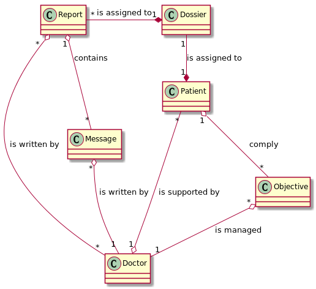
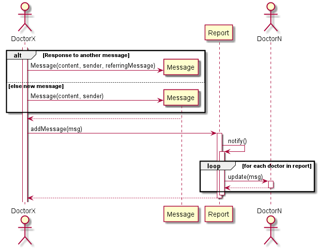
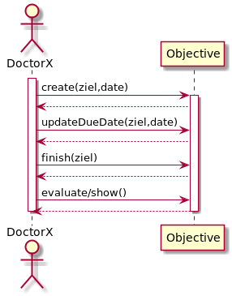
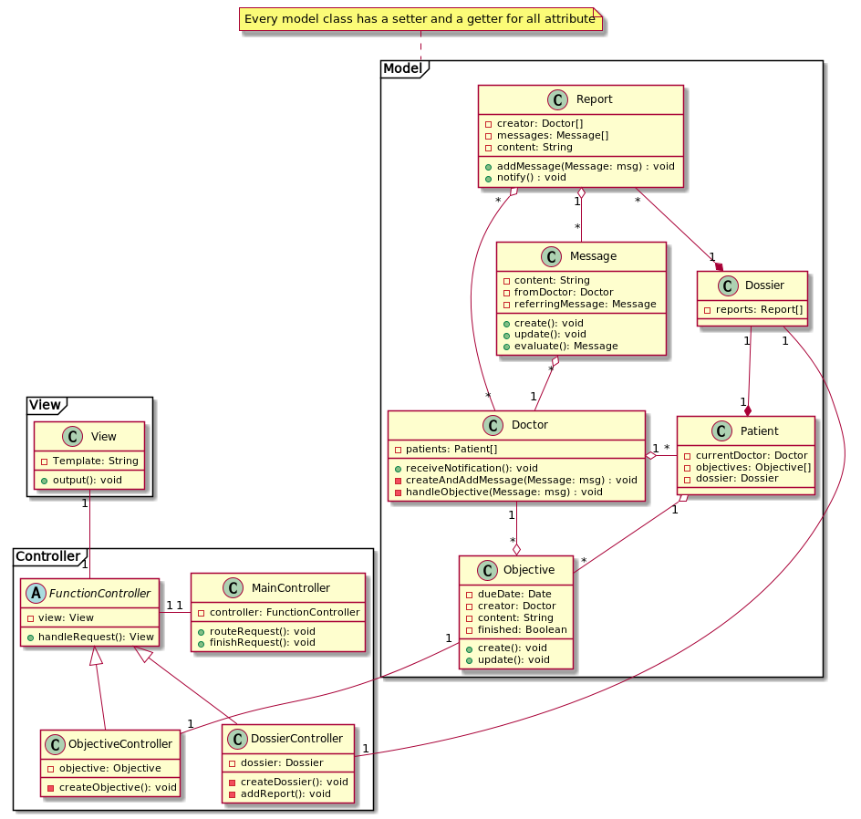

# Task 4 Dokumentation
## Domain Diagramm

Im Domain Diagramm ist erkennbar, dass der Patient ein Dossier besitzt, welches 
jeweils mehrere Rapporte enthält. Dise Rapporte werden vom Doktor erfasst.

Jeder Doktor hat die Möglichkeit, zu einem Rapport eine Rückfrage zu stellen,
in dem er eine Message verfasst.

Zudem kann der Arzt für seine Patienten jeweils Objectives (Ziele) erfassen.
 
## Sequenzdiagramme
### Rückfragen

Der Doktor hat die Möglichkeit, eine Nachricht zu schrieben. Diese
wird anschliessend dem Report angehängt und alle Doktoren, welche am Report
gearbeitet haben werden benachrichtigt.

### Ziele erfassen und verwalten

Die Ziele können nur vom Doktor verwaltet werden. Jedes Ziel hat ein Enddatum,
an welchem der Patient das Ziel erfüllt haben sollte. Die Prüfung, ob dies der 
Fall ist wird vom Doktor erledigt. Anschliessend kann der Doktor das Ziel schliessen.
## Klassendiagramm

Unserer Software soll nach MVC aufgebaut werden.
Die Klassen für den Controller und die View werden noch erweitert und ergänzt, 
sobald wir uns mit dem Framework auseinandersetzen konnten.

