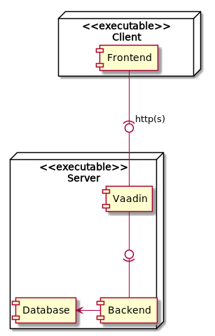
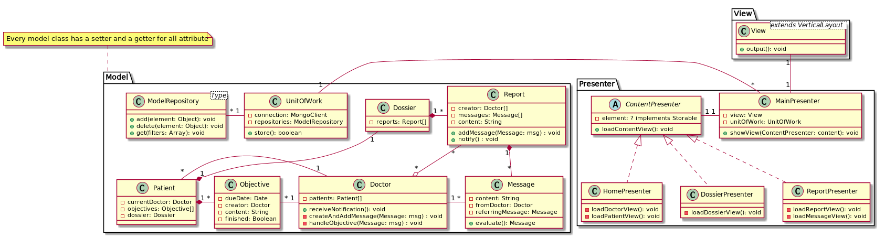

# Task 5 Dokumentation
## Domain Diagramm

## Deployment Diagramm

## Klassendiagramm

Unserer Software soll nach MVP aufgebaut werden.
Für die Datenanbindung arbeiten wir sowohl mit dem Repository Pattern, wie auch
mit dem UnitOfWork Pattern. Dabei stellt eine UnitOfWork immer eine Datenbank Transaktion
dar. Dabei wird als Datenbankserver eine MongoDB verwendet.

Die gesamte View wird mittels Vaadin realisiert.